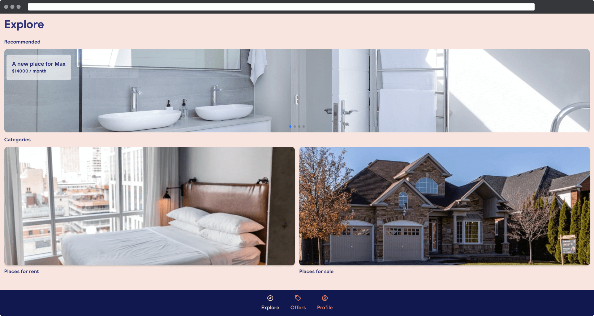

    ✨ YOUR_APP_NAME
---

### ✨ About:

YOUR_APP_DESCRIPTION

---

### ✨ Stack:

- [React](https://ru.reactjs.org/) 💡
- [Redux](https://redux.js.org/) 💡
- [Redux Toolkit](https://redux-toolkit.js.org/) 💡
- [React Router](https://reactrouter.com/docs/en/v6/getting-started/overview) 💡
- [React Hook Form](https://react-hook-form.com/) 💡
- [Axios](https://axios-http.com/docs/intro) 💡
- [React Icons](https://react-icons.github.io/react-icons/) 💡
- [Tailwind CSS](https://tailwindcss.com/) 💡
- [Sass](https://sass-lang.com/) 💡